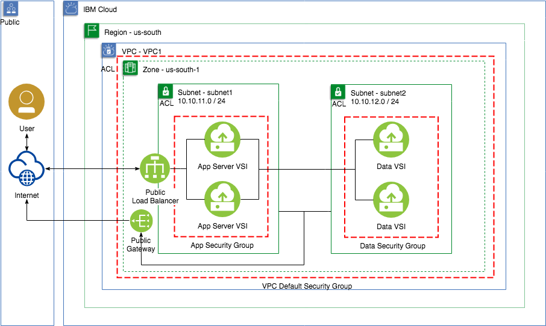

# Use GUI, CLI or API to run a Web App in VPC network  
## Purpose

Build a load balanced [3-tier](https://en.wikipedia.org/wiki/Multitier_architecture) web application that separates the web / application and data tiers by placing them in separate sub-networks.

Based on [Solution Tutorials - Highly Available & Scalable Web App](https://cloud.ibm.com/docs/tutorials?topic=solution-tutorials-highly-available-and-scalable-web-application#use-virtual-servers-to-build-highly-available-and-scalable-web-app)

This document illustrates the deployment of [WordPress](https://wordpress.com) on top of a [LAMP stack](https://en.wikipedia.org/wiki/LAMP) (software_bundle) hosted on [IBM Virtual Private Cloud Infrastructure](https://cloud.ibm.com/docs/vpc) (VPC). The main objective is to highlight the features of IBM VPC but at the end of this tutorial, a tested and working application environment will be deployed.

Features:
1. Application
  - A load balanced application - WordPress
  - Using multiple databases - HyperDB
  - With master/slave data replication - MySQL
2. Infrastructure
  - Public isolation - VPC
  - Where application and data layers are deployed on separate subnets
  - With separate network security groups
  - Using bring-your-own-IP

Below is the IBM Virtual Private Cloud (VPC) architecture of the solution showing public isolation for both Application (through an Application Load Balancer) and data.

## VPC Architecture

## Assumptions and Limitations

- This document expects the reader to have a basic level of understanding of network infrastructure and application deployment on a Linux environment.
- The solution will use HTTP.
- The LAMP stack will use [Nginx](https://www.nginx.com/) Web Application Server and [MySQL](https://www.mysql.com/) will be deployed on a separate server.
- Fixes to issues found during the deployment of the environment have been provided. However, these fixes are as of the time of this writing and other issues may occur with new deployments or versions of the stack.
- Not shown in the architecture diagram is the use a [public IP](https://en.wikipedia.org/wiki/IP_address) addresses in order to deploy the application. IBM VPC uses a [floating IP and a Public Gateway](https://cloud.ibm.com/docs/vpc?topic=vpc-about-networking-for-vpc) to allow internet traffic. We will use these to access the VSIs and pull the software from public repositories. Once the images are deployed, floating IPs will be removed for improved system isolation.
- Bring-Your-Own-Image (BYOI) is not included.
- Network storage is not included.

## VPC Functional Coverage
| Function | Result | Notes |
| -------- | ------ | ----- |
| VPC | :white_check_mark: | |
| Subnets | :white_check_mark: | |
| Private IP (BYOIP) | :white_check_mark: | |
| Virtual Server Instance (VSI) | :white_check_mark: | |
| Multiple Network Interfaces in VSI | :white_check_mark: | |
| Application Load Balancer | :white_check_mark: | |
| Floating IPv4 | :white_check_mark: | :warning: Temporary use to deploy application images |
| Public Gateway | :white_check_mark: | :warning: Temporary use to deploy application images |

### System Requirements

#### Operating system

| Tier  | Operating system |
| ------------- | ------------- |
| Web Server & Application | Ubuntu 20.04  |
| Data  | Ubuntu 20.04  |

#### Hardware

| Tier | Type | Profile |
| ------------- | ------------- | ------- |
| Web Server and Application  |  VSI | bx2-4x16 |
| Data| VSI  | bx2-4x16 |

#### Runtime Services

| Service Name |
| ------- |
| None at this time. |

## Documented Steps
To build this scenario we will first deploy the VPC infrastructure followed by the deployment and configuration of the application. Then, we will build and configure an HA application cluster to enable scalability of the application when higher traffic requires new nodes added to the application load balancer.

## Prerequisites

The following needs to be executed before starting with the deployment:
1. Have access to a public SSH key as described in [SSH Keys](https://cloud.ibm.com/docs/vpc-on-classic-vsi?topic=vpc-on-classic-vsi-ssh-keys#ssh-keys).
2. Create a new resource group called `VPC1` as described in [Managing resource groups](https://cloud.ibm.com/docs/resources?topic=resources-rgs#rgs)
3. Once the `VPC1` resource group has been created, update user permissions and provide the required access as described in [Managing user permissions for VPC resources](https://cloud.ibm.com/docs/vpc-on-classic?topic=vpc-on-classic-managing-user-permissions-for-vpc-resources)

### Deploy VPC Infrastructure

IBM Cloud provides four methods to deploy the VPC infrastructure and three of them are documented here. The reader may follow the instructions using one of these to set up the environment for this scenario.

[Deploy using CLI](CLI.md)

[Deploy using API](API.md)

[Deploy using UI](UI.md)

### Install Web Application

Deploy the application once the VPC infrastructure has been deployed.

[Install Application Layer](WebApp.md)

## Error Scenarios

Application layer failures are included during the deployment and test of the software stack. No infrastructure failures were introduced.

## Documentation Provided

Useful links for VPC documentation.

[Getting started with IBM Cloud Virtual Private Cloud](https://cloud.ibm.com/docs/vpc-on-classic?topic=vpc-on-classic-getting-started)

[Assigning role-based access to VPC resources](https://cloud.ibm.com/docs/vpc-on-classic?topic=vpc-on-classic-assigning-role-based-access-to-vpc-resources)

[IBM Cloud CLI for VPC Reference](https://cloud.ibm.com/docs/vpc-on-classic?topic=vpc-infrastructure-cli-plugin-vpc-reference)

[VPC API](https://cloud.ibm.com/apidocs/vpc-on-classic)

[IBM Cloud Virtual Private Cloud API error messages](https://cloud.ibm.com/docs/vpc-on-classic?topic=vpc-on-classic-rias-error-messages)

## Observations
None.
