## Purpose

This section provides the steps to create a VPC and the required resources for the scenario described in [*Basic 3-Tier Web App (with LB)*](README.md).

For this section, the IBM Cloud User Interface (UI) will be used.

## Prerequisites

1. Any prerequisites mentioned in the *Basic 3-Tier Web App (with LB)* main page like providing required user access.

## Activities executed to setup the VPC environment

For an overview of IBM Virtual Private Cloud (VPC), please refer to [About VPC](https://cloud.ibm.com/docs/vpc).

1. Create an SSH key to be used when a virtual instance (VSI) resource is created.
2. Create a VPC.
3. Create Address Prefixes (CIDR) for the VPC.
4. Create Subnets.
5. Choose a profile and an image to create a Virtual Server Instance (VSI)
6. Create VPC VSIs.
7. Create and configure a Load Balancer.
8. Create Floating IPs and assign them to the VSIs.
9. Add rules to the VPC's default Security Group.

Once the above steps are completed, the VPC infrastructure will be ready for the next activities.

## Login to IBM Cloud

Browse to https://cloud.ibm.com/login and login.

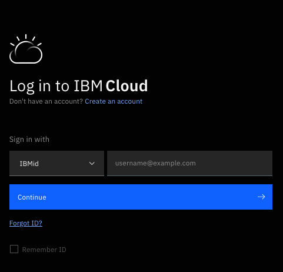

# Deploy VPC Infrastructure   

## About Resource Group, Region and Zone

Resourced in IBM Cloud are assigned to a Resource Group. In our case, we want to use resource group **VPC1** that was created previously. In addition, we will allocate the resources in the **us-south** region and zone **Dallas 1**.

For more information on Regions and Zones please refer to [Creating a VPC in a different region](https://cloud.ibm.com/docs/vpc?topic=vpc-creating-a-vpc-in-a-different-region).

Select VPC Infrastructure from the hamburger menu in the upper left corner.

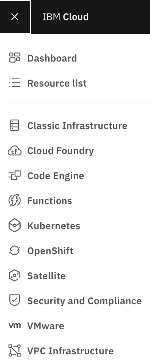

## Deploy VPC Infrastructure

## Create an SSH Key

An SSH key is required when creating a VPC instance. From the VPC Infrastructure menu select "SSH keys" and then "Create +".  Enter name, select region (e.g. Dallas) and add the contents of your RSA public key. Hit the "Add SSH key" button to save.

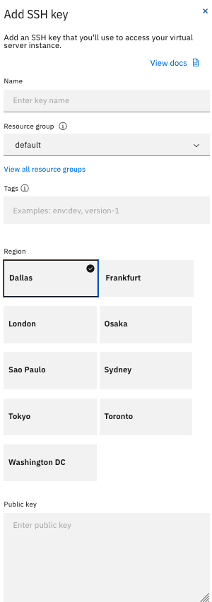

## Create a VPC

Create a VPC named `wp-vpc`.

On the *VPC Infrastructure* menu, select "VPCs" under "Network.". Then select "Create +". Fill out the form and hit the "Create virtual private cloud" button.

Use `subnet0` for subnet and **attach** a Public Gateway. The public gateway will be needed to access the application software from the public repositories.

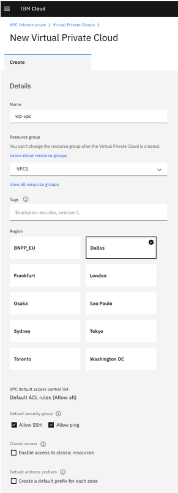

## Create Address Prefixes

For more information on address prefixes, please refer to [Understanding IP address ranges, address prefixes, regions, and subnets](https://cloud.ibm.com/docs/vpc?topic=vpc-vpc-addressing-plan-design).

Create address prefixes for `10.10.11.0/24` and `10.10.12.0/24`.

On the *VPC Infrastructure* menu, select "VPCs" under "Network.". Select VPC `wp-vpc` to get the details, then select "Address prefixes" and "Create".

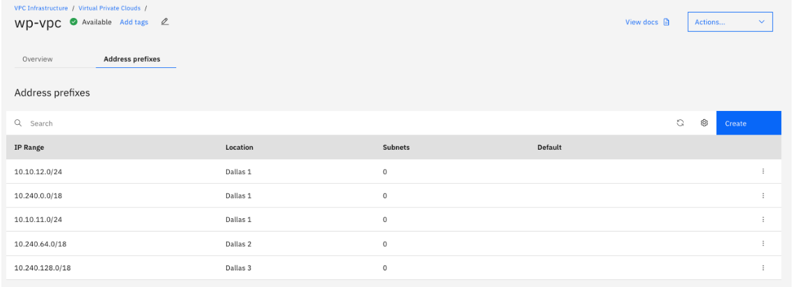

## Create Two VPC Subnets

Create two VPC Subnets for ipv4-cidr-blocks `10.10.11.0/24` and `10.10.12.0/24`.  

The __*application*__ tier will be `subnet1` and the __*data*__ tier will be `subnet2`.

On the *VPC Infrastructure* menu, select "Subnets" and then click "Create +". Create each subnet and attach the VPC's public gateway.

**Subnet1**
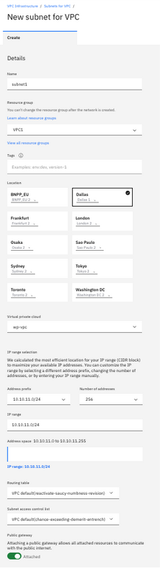

**Subnet2**
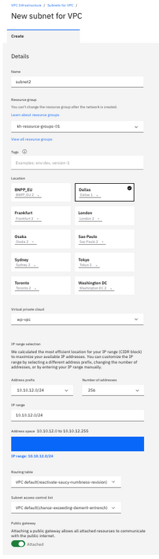

### VPC Subnets

The initial status of a newly created subnet is set to __*pending*__.  You must wait until the subnet status is available before assigning any resources to it.

To check the subnet status, refresh the Subnets list.  Keep checking until the status is set to available.

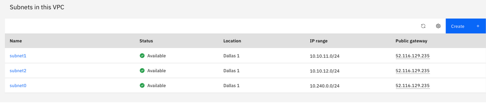

### Optionally, Remove Original Subnet0

Creating a VPC requires a subnet (`subnet0`) that uses a default address prefix.  Since we will not be using the default address prefixes nor the initial subnet, those can be deleted. To delete `subnet0`, on the *VPC Infrastructure* menu, select "Subnets" and then the three periods (`...`) to select delete.

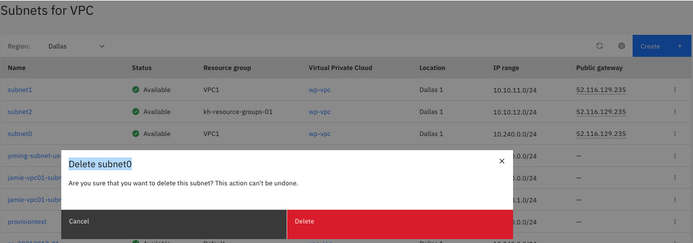

## VPC Instance Profiles and Images

Before continuing we must select an instance profile and image for our VPC instances.  
- The profile describes the instance size in terms of CPUs and memory.
- The image is the operating system that will be loaded into the instance.

We will use the `b-4x16` balanced profile for all our instances, which is 4 CPUs and 16G of memory.  For OS image, the `ubuntu-18.04-amd64` which is Ubuntu Linux (18.04 LTS Bionic Beaver Minimal Install).

## Security Groups and Access Control Lists

For purposes of this use case, we will create two security groups for application and data servers. For more information on security groups, please refer to [Security in your IBM Cloud VPC](https://cloud.ibm.com/docs/vpc?topic=vpc-using-security-groups).

In our scenario we will configure the security groups to enable the required ports and protocols.

On the *VPC Infrastructure* menu, select "Security groups" and then "New security group".

**Application Security Group - app_sg**

- Add an inbound rule to allow all tcp access on port 22 for SSH access to the VSIs.
- Add an inbound rule to allow all tcp access on port 80 for HTTP access to the web application.
- Add an outbound rule to allow all access.

**Data Security Group - data_sg**

- Add an inbound rule to allow all tcp access on port 22 for SSH access to the VSIs.
- Add an inbound rule to allow all tcp access on port 3306 for MySQL (default port for MySQL).
- Add an outbound rule to allow all access.

## Create Data Tier VPC Instances - Subnet2

Now we have all the required information, let's create two Ubuntu 18.04 VSIs in `subnet2` for the MySQL backend.

On the *VPC Infrastructure* menu, select "Virtual server instances" and then "New instance".

Select:
- Enter instance name (the UI does not allow upper case for resource names).
- Select Ubuntu 18.04 image and balanced 4x16 profile.
- SSH Key = `vpc-key`
- Change `eth0` Network Interface to pick `subnet2` and `data_sg`.

**Instance = MySQL1**

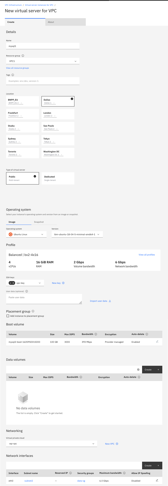

**Instance = MySQL2**

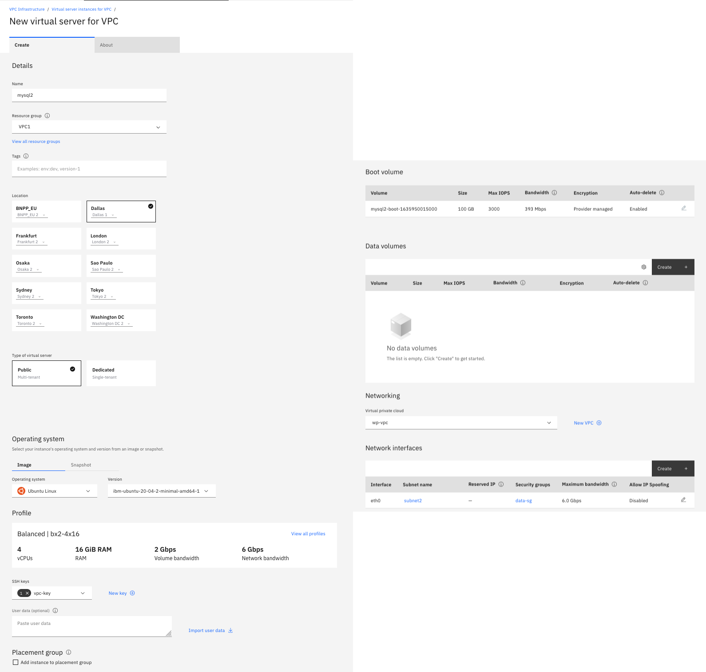

## Create Web and Application tier VPC instances - Subnet1

Next, create two Ubuntu VSIs in `subnet1` for the application tier.

In this case we will create a second ethernet interface to connect to resources in `subnet2` where MySQL servers will be located.

Select:
- Enter instance name (the UI does not allow upper case for resource names).
- Select Ubuntu 18.04 image and balanced 4x16 profile.
- SSH Key = `vpc-key`
- Change `eth0` Network Interface to pick `subnet1` and `app_sg`.
- Add `eth1` Network Interface to pick `subnet2` and `data_sg`.

**Instance = AppServ1**

**Instance = AppServ2**

## Create Web Tier VPC Instance

In this section we will create and configure a VPC load balancer for the web application tier. For more information on configuration of load Balancers (listeners, back-end pools, etc.) see [Using Load Balancers for VPC](https://cloud.ibm.com/docs/vpc?topic=vpc-nlb-vs-elb)

### Create the Load Balancer

On the *VPC Infrastructure* menu, select "Load balancers" and then "New load balancer".

Create a `public` load balancer `LB1` on `subnet1`. Configuring the load balancer involves creating a pool, pool members (application servers), and a listener that points to our application servers.

**Load Balancer = LB1**

Select:
- Enter instance name (the UI does not allow upper case for resource names).
- Resource Group = `VPC1`
- Type = `Public`
- Select `subnet1` (10.10.11.0/24)
- Back-end pool:
   - Add a Back-end pool `pool1` for `http` protocol using a `round-robin` method and health checks every `20 seconds`.
   
   - Attach `AppServ1` and `AppServ2`
   
- Front-end listener
   - Add a public front-end `http` listener for our web application using port `80` and assign it to back-end pool `pool1`
   

**Note**: Load Balancer health checks will fail until the application is installed in section [Install and Configure Application Software](WebApp.md).

## Prepare to Load Application Software

Because custom images are not supported (Bring-Your-Own-Image), we will enable access to the internet for each VPC instance so we can download the required application software. Since the VSIs are isolated from the internet, a floating IPs will be used to temporarily gain access. Once the application software has been installed, internet access will be disabled.

**Add Public IP to each Data and Application servers**

On the *VPC Infrastructure* menu, select "Virtual server instances" and then select one server to drill down to the details. Under "Network interfaces" click the pencil icon to edit it on eth0 and select "Reserve a new floating IP" at Floating IP address.

**AppServ1**
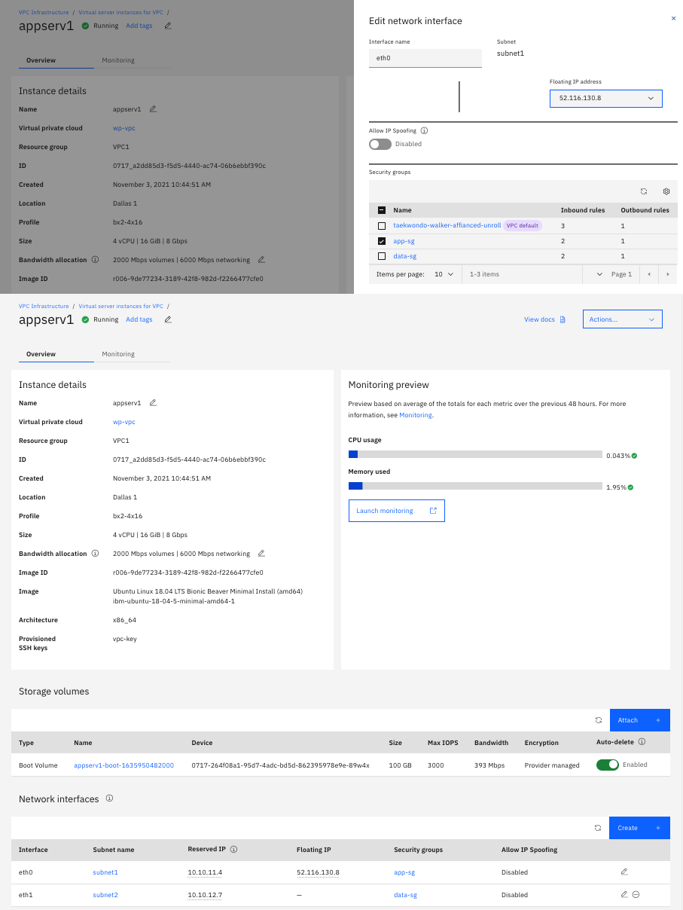
**AppServ2**
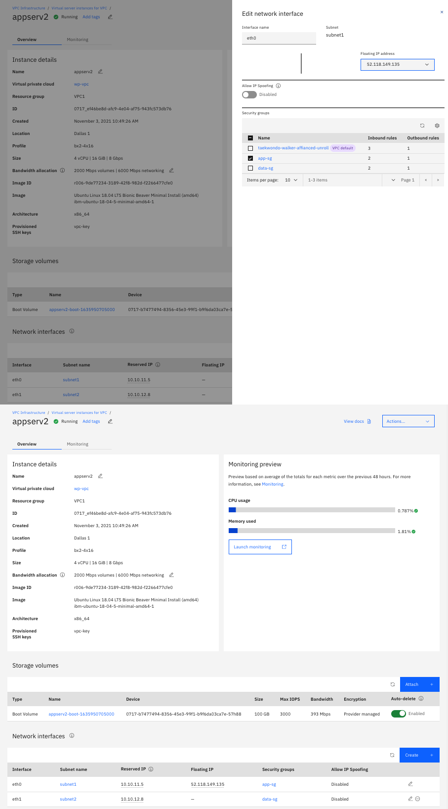
**MySQL1**
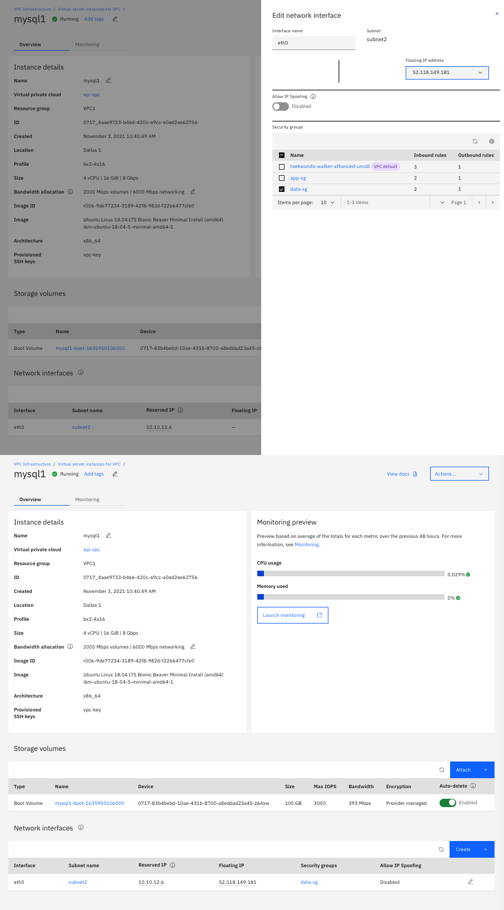
**MySQL2**
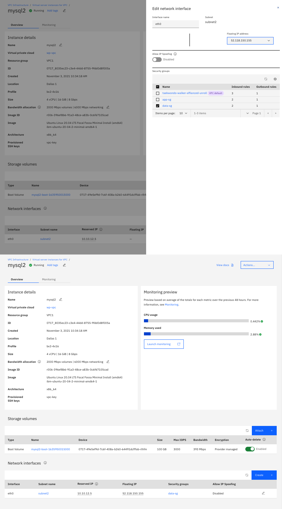

## Next Step

At this point the VPC infrastructure components are ready for the next step which is to deploy the application software to the VSIs and test the Load Balancer. Please go to [Install and Configure Application Software](WebApp.md) for the next steps.

## Remove Floating IPs

Once the environment is up and running, you can remove the floating IPs to remove public access on the VSIs.

On the *VPC Infrastructure* menu, select "Virtual server instances" and then select one server to drill down to the details. Under "Network interfaces" select the `minus` sign on `eth0` to remove a Floating IP.

Optionally, once the Floating IPs have been removed, you can also release the Floating IPs if there is no longer a need for them.

On the *VPC Infrastructure* menu, select "Virtual server instances" and then select one server to drill down to the details. Under "Network interfaces" select the `minus` sign on `eth0` to remove a Floating IP.
